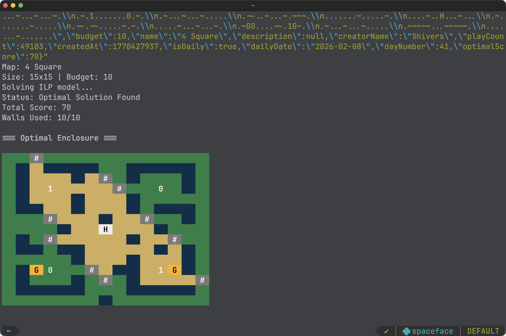
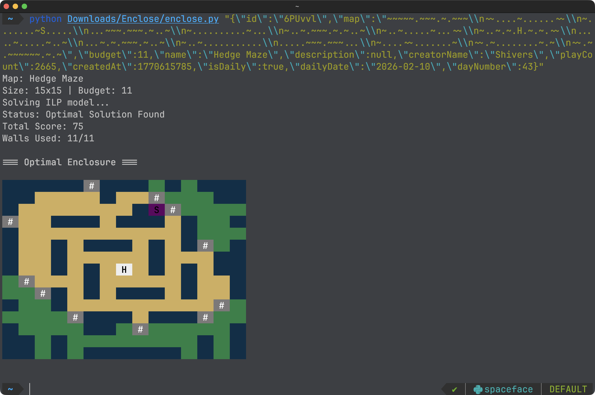
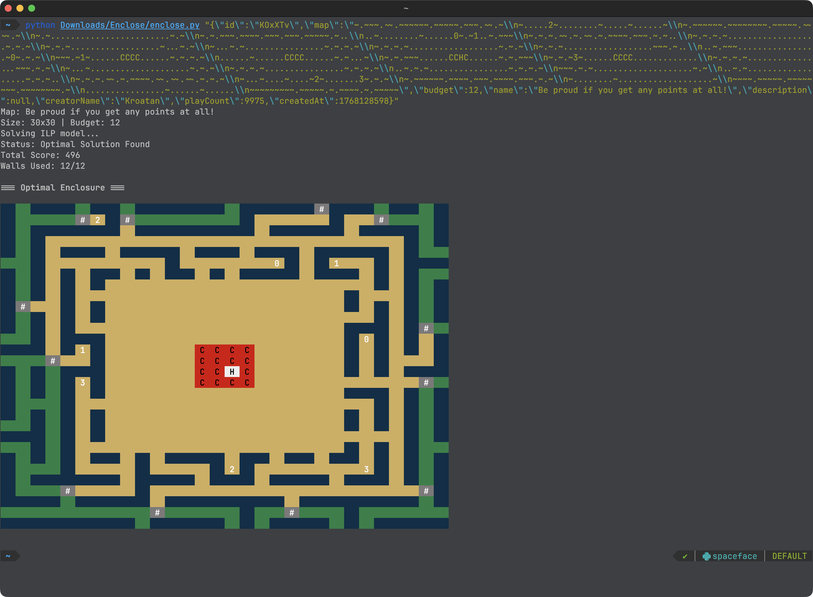

# Enclose.horse solver

A tiny ILP solver for the [Enclose.horse](https://enclose.horse) game.

### Usage

0. `pip install pulp`
1. Open a puzzle on enclose.horse, open the developer console, and paste in `copy(JSON.stringify(JSON.stringify(__LEVEL__)))` to copy the puzzle data to your clipboard.
2. Run `python solver.py [paste the copied data here]` to get the solution.
3. Profit!

### Examples

##### [enclose.horse/play/2026-02-08](https://enclose.horse/play/2026-02-08)

##### [enclose.horse/play/2026-02-10](https://enclose.horse/play/2026-02-10)

##### [enclose.horse/play/KOxXTv](https://enclose.horse/play/KOxXTv)

